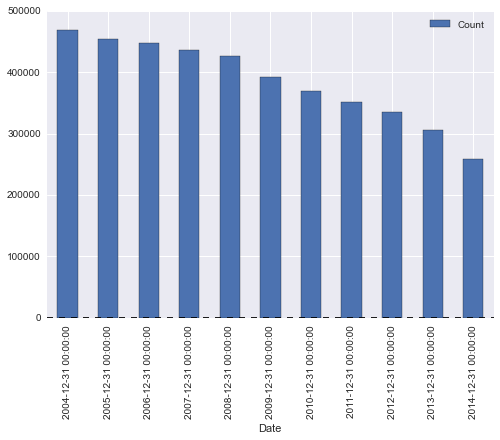
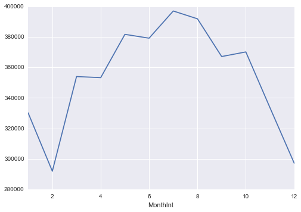
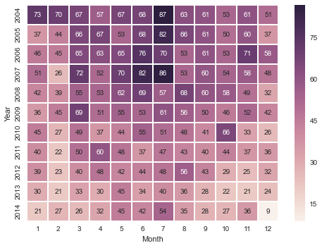
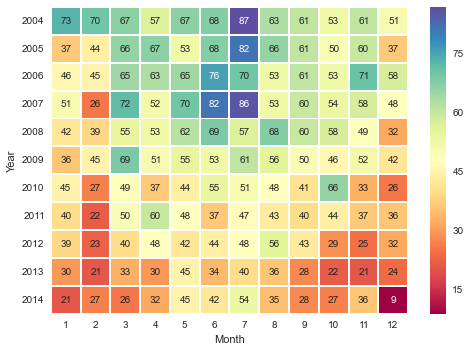

Solutions for intro to data viz day
======================
The files that produced these scripts are provided in both iPython notebook format and regular python scripts.  Below is an exported view of what the iPython files looks like.

## Chart 1


```python
import seaborn as sns
import pandas as pd
import matplotlib.pyplot as plt
```


```python
# Load in the yearly data.
df = pd.read_csv('../data/chitown_crime_yearly.csv')

# Convert the Date column to a datetime object.
df['Date'] = pd.to_datetime(df['Date'])

# Set the Date column to be the index.
df = df.set_index('Date')

# Inspect your dataframe.
df.head()
```


<div style="max-height:1000px;max-width:1500px;overflow:auto;">
<table border="1" class="dataframe">
  <thead>
    <tr style="text-align: right;">
      <th></th>
      <th>Primary Type</th>
      <th>Count</th>
    </tr>
    <tr>
      <th>Date</th>
      <th></th>
      <th></th>
    </tr>
  </thead>
  <tbody>
    <tr>
      <th>2004-12-31</th>
      <td> ARSON</td>
      <td> 778</td>
    </tr>
    <tr>
      <th>2005-12-31</th>
      <td> ARSON</td>
      <td> 691</td>
    </tr>
    <tr>
      <th>2006-12-31</th>
      <td> ARSON</td>
      <td> 726</td>
    </tr>
    <tr>
      <th>2007-12-31</th>
      <td> ARSON</td>
      <td> 712</td>
    </tr>
    <tr>
      <th>2008-12-31</th>
      <td> ARSON</td>
      <td> 644</td>
    </tr>
  </tbody>
</table>
</div>


```python
# Because the index is a datetime object.
# We can use the pandas resample function which is like a groupby for time.
# The 'A' means groupby year... if you did 'M' it would be month.
# The docs for df.resample() are here.  http://bit.ly/13F2XvP

# So we groupby the year and sum the counts of the crime, then plot them as a bar plot
yeartots = df.resample(rule='A', how='sum').plot(kind='bar')
```





```python
'''
TIME FREQUENCYS RULE CODES FOR PANDAS .resample(rule='M') FUNCTION
===============================================
B   business day frequency
C   custom business day frequency (experimental)
D   calendar day frequency
W   weekly frequency
M   month end frequency
BM  business month end frequency
MS  month start frequency
BMS business month start frequency
Q   quarter end frequency
BQ  business quarter endfrequency
QS  quarter start frequency
BQS business quarter start frequency
A   year end frequency
BA  business year end frequency
AS  year start frequency
BAS business year start frequency
H   hourly frequency
T   minutely frequency
S   secondly frequency
L   milliseconds
U   microseconds
'''
```


```python

```
<br>

## Chart 2:


```python
import seaborn as sns
import pandas as pd
import matplotlib.pyplot as plt
```


```python
# Step 1:  Read data in.
df = pd.read_csv('../data/chitown_crime_monthly.csv')

# Step 2:  Convert the Date column to a datetime object
df['Date'] = pd.to_datetime(df['Date'])

# STEP 3: Make a column that is just the year interger ie 2012 YYYY
df['YearInt'] = df['Date'].map(lambda x: x.year)

# STEP 4: Make a column that is just the number of the month
df['MonthInt'] = df['Date'].map(lambda x: x.month)

# STEP 5: Make a column that is just the number of the month
df['MonthName'] = df['Date'].map(lambda x: x.strftime('%b'))

# STEP 6: Groupby that month column you made, and sum the counts
df2 = df.groupby('MonthInt')['Count'].sum()

# STEP 8:  Plot the graph as you see fit.  
```


```python
df.head()
```


<div style="max-height:1000px;max-width:1500px;overflow:auto;">
<table border="1" class="dataframe">
  <thead>
    <tr style="text-align: right;">
      <th></th>
      <th>Date</th>
      <th>Primary Type</th>
      <th>Count</th>
      <th>YearInt</th>
      <th>MonthInt</th>
      <th>MonthName</th>
    </tr>
  </thead>
  <tbody>
    <tr>
      <th>0</th>
      <td>2004-01-31</td>
      <td> ARSON</td>
      <td> 73</td>
      <td> 2004</td>
      <td> 1</td>
      <td> Jan</td>
    </tr>
    <tr>
      <th>1</th>
      <td>2004-02-29</td>
      <td> ARSON</td>
      <td> 70</td>
      <td> 2004</td>
      <td> 2</td>
      <td> Feb</td>
    </tr>
    <tr>
      <th>2</th>
      <td>2004-03-31</td>
      <td> ARSON</td>
      <td> 67</td>
      <td> 2004</td>
      <td> 3</td>
      <td> Mar</td>
    </tr>
    <tr>
      <th>3</th>
      <td>2004-04-30</td>
      <td> ARSON</td>
      <td> 57</td>
      <td> 2004</td>
      <td> 4</td>
      <td> Apr</td>
    </tr>
    <tr>
      <th>4</th>
      <td>2004-05-31</td>
      <td> ARSON</td>
      <td> 67</td>
      <td> 2004</td>
      <td> 5</td>
      <td> May</td>
    </tr>
  </tbody>
</table>
</div>


```python
df2 = df.groupby('MonthInt')['Count'].sum()
df2.plot()
```



```python
# Another variation
df2 = df.groupby('YearInt')['Count'].sum()
df2.plot()
```
```python
# A third variation.
df3 = df.groupby(['Primary Type', 'YearInt'])['Count'].sum()
df3.unstack().T.plot()

```
---
<br>
# Chart 3:


```python
import seaborn as sns
import pandas as pd
import matplotlib.pyplot as plt
```


```python
df = pd.read_csv('../data/chitown_crime_monthly.csv')
```


```python
df['Date'] = pd.to_datetime(df['Date'])
print df.info()
```

    <class 'pandas.core.frame.DataFrame'>
    Int64Index: 3836 entries, 0 to 3835
    Data columns (total 3 columns):
    Date            3836 non-null datetime64[ns]
    Primary Type    3836 non-null object
    Count           3836 non-null int64
    dtypes: datetime64[ns](1), int64(1), object(1)
    memory usage: 119.9+ KB
    None


```python
# Make a new column just the year Interger of the year
df['Year'] = df['Date'].map(lambda x: x.year)

df['Month'] = df['Date'].map(lambda x: x.month)
# (If you wanted to make it the name of the Month)  # df['Month'] = df['Date'].map(lambda x: x.strftime('%B'))

df.head()
```


<div style="max-height:1000px;max-width:1500px;overflow:auto;">
<table border="1" class="dataframe">
  <thead>
    <tr style="text-align: right;">
      <th></th>
      <th>Date</th>
      <th>Primary Type</th>
      <th>Count</th>
      <th>Year</th>
      <th>Month</th>
    </tr>
  </thead>
  <tbody>
    <tr>
      <th>0</th>
      <td>2004-01-31</td>
      <td> ARSON</td>
      <td> 73</td>
      <td> 2004</td>
      <td> 1</td>
    </tr>
    <tr>
      <th>1</th>
      <td>2004-02-29</td>
      <td> ARSON</td>
      <td> 70</td>
      <td> 2004</td>
      <td> 2</td>
    </tr>
    <tr>
      <th>2</th>
      <td>2004-03-31</td>
      <td> ARSON</td>
      <td> 67</td>
      <td> 2004</td>
      <td> 3</td>
    </tr>
    <tr>
      <th>3</th>
      <td>2004-04-30</td>
      <td> ARSON</td>
      <td> 57</td>
      <td> 2004</td>
      <td> 4</td>
    </tr>
    <tr>
      <th>4</th>
      <td>2004-05-31</td>
      <td> ARSON</td>
      <td> 67</td>
      <td> 2004</td>
      <td> 5</td>
    </tr>
  </tbody>
</table>
</div>


```python
# Lets just check out only the Arsons
arson = df[df['Primary Type'] == 'ARSON']

# Make a piviot table so the rows are the years, and the cols are the months, and the values are the countss
arson_pivot = arson.pivot('Year', 'Month', 'Count')
arson_pivot.head()
```


<div style="max-height:1000px;max-width:1500px;overflow:auto;">
<table border="1" class="dataframe">
  <thead>
    <tr style="text-align: right;">
      <th>Month</th>
      <th>1</th>
      <th>2</th>
      <th>3</th>
      <th>4</th>
      <th>5</th>
      <th>6</th>
      <th>7</th>
      <th>8</th>
      <th>9</th>
      <th>10</th>
      <th>11</th>
      <th>12</th>
    </tr>
    <tr>
      <th>Year</th>
      <th></th>
      <th></th>
      <th></th>
      <th></th>
      <th></th>
      <th></th>
      <th></th>
      <th></th>
      <th></th>
      <th></th>
      <th></th>
      <th></th>
    </tr>
  </thead>
  <tbody>
    <tr>
      <th>2004</th>
      <td> 73</td>
      <td> 70</td>
      <td> 67</td>
      <td> 57</td>
      <td> 67</td>
      <td> 68</td>
      <td> 87</td>
      <td> 63</td>
      <td> 61</td>
      <td> 53</td>
      <td> 61</td>
      <td> 51</td>
    </tr>
    <tr>
      <th>2005</th>
      <td> 37</td>
      <td> 44</td>
      <td> 66</td>
      <td> 67</td>
      <td> 53</td>
      <td> 68</td>
      <td> 82</td>
      <td> 66</td>
      <td> 61</td>
      <td> 50</td>
      <td> 60</td>
      <td> 37</td>
    </tr>
    <tr>
      <th>2006</th>
      <td> 46</td>
      <td> 45</td>
      <td> 65</td>
      <td> 63</td>
      <td> 65</td>
      <td> 76</td>
      <td> 70</td>
      <td> 53</td>
      <td> 61</td>
      <td> 53</td>
      <td> 71</td>
      <td> 58</td>
    </tr>
    <tr>
      <th>2007</th>
      <td> 51</td>
      <td> 26</td>
      <td> 72</td>
      <td> 52</td>
      <td> 70</td>
      <td> 82</td>
      <td> 86</td>
      <td> 53</td>
      <td> 60</td>
      <td> 54</td>
      <td> 58</td>
      <td> 48</td>
    </tr>
    <tr>
      <th>2008</th>
      <td> 42</td>
      <td> 39</td>
      <td> 55</td>
      <td> 53</td>
      <td> 62</td>
      <td> 69</td>
      <td> 57</td>
      <td> 68</td>
      <td> 60</td>
      <td> 58</td>
      <td> 49</td>
      <td> 32</td>
    </tr>
  </tbody>
</table>
</div>


```python
sns.heatmap(arson_pivot, annot=True);
```





```python
# That is pretty good, but lets change some color and fix those y axis labels.
# use cmap to change color.
sns.heatmap(arson_pivot, annot=True, cmap='Spectral');


# Because seaborn is built ontop of Matplotlib. You can also refer to your seaborn chart with matplot commands
plt.yticks(rotation=0);

# Lets also make it bigger
plt.figure(figsize=(13,13));
```



